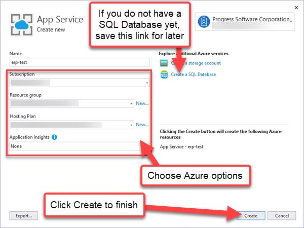
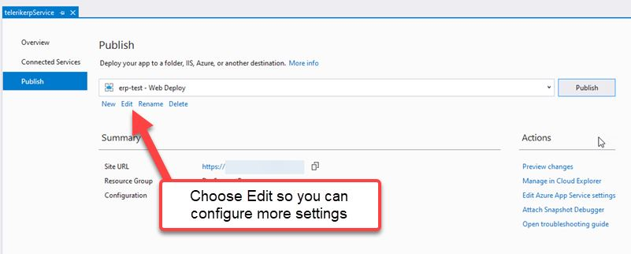
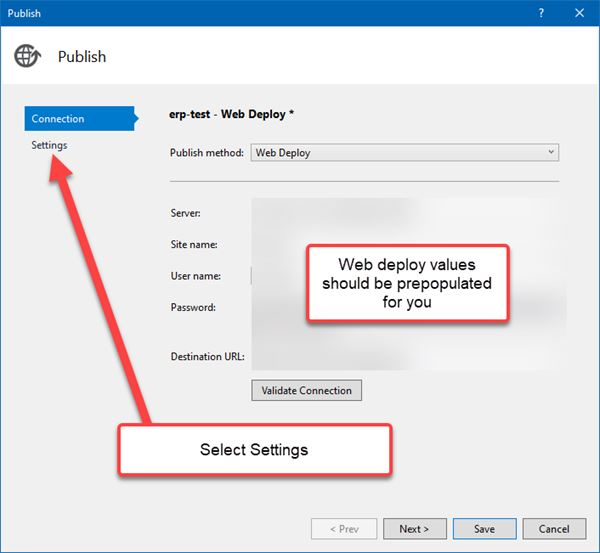
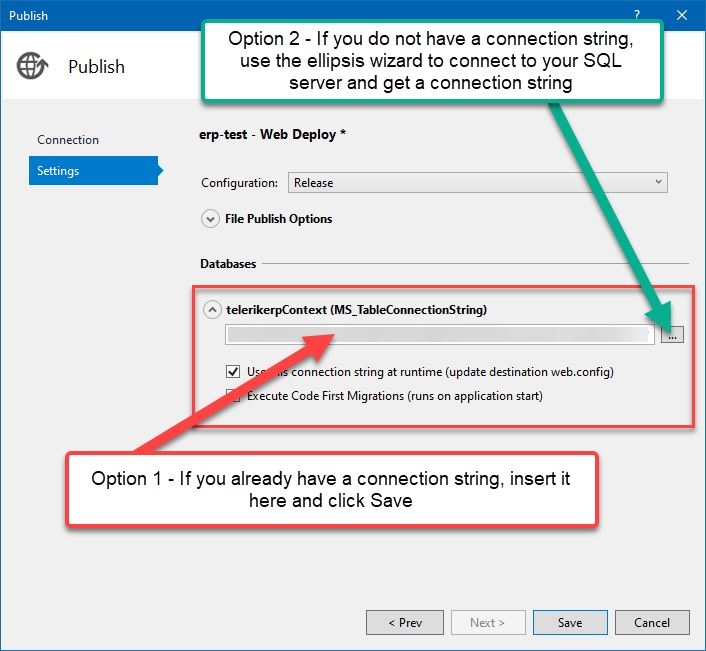
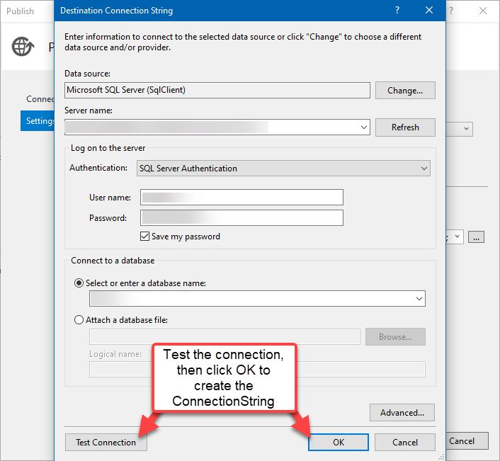


# ERP Deployment

The ERP demo has two major parts; Web application and Xamarin.Forms applications. This readme will take you through deploying them in your environment.

## Part 1. Web Application Setup

The ERP service application is an ASP.NET application that connects to a SQL server database. In this tutorial we will be deploying it to an Azure App Service, but you can technically deploy it to any web server you prefer.

#### Step 1. Opening the solution in Visual Studio

After you've downloaded (or cloned) the repostiry, navigate to the `ERP/service/` folder and open the **telerikerp.sln** file.

#### Step 2. Restore the solution's NuGet packages.

1. Right-click on the Solution (not the project)
2. Select "Restore NuGet Packages"
3. Rick-click on the solution and select Build

When the build is complete, you can move on to publishing the web application.

#### Step 3. Publish the Web Application

Right-click on the project in the Solution Explorer and select "**Publish...**". The publish target wizard will let you select an endpoint. App Service, Virtual Machine, IIS/FTP or Folder.

In this walkthrough we're using Azure App Service, if you do not have a preexisting one, you can select "New" and then "Create Profile"

The App Service wizard will walk you through creating the new Azure App Service, on the last step you'll see the following:

After this is done, you'll see a Publish Profile on the Publish page. This has the settings to successfully deploy the application to Azure.

If you already have a SQL database setup, go ahead and click **Publish**. If you do not 

#### Extra 1 - SQL Server

If you did not create a new SQL database in the previous step and need to add a conneciton string to your existing server. To update this, select the Edit button:

Select "Settings" tab:

Depending on how you setup your SQL server, you should already have a connection string that you can paste in now:

If you do not have a connection string handy, you can get one by using the ellipsis and signing into the SQL server

After you've saved the PublishProfile edits, you can go ahead and publish the application using the **Publish** button at the top right.

#### Extra 2 - Code-First Migration and Seed Data

The demo project has already scaffolded the IntialMigrate for you using [Entity Framework - Code First Migration](https://docs.microsoft.com/en-us/ef/ef6/modeling/code-first/migrations/)

You only need to open Visual Studio **Package Manager Console** and run the `Update-Database` Entity Framework command.  You should see the following as a result:

If this does not work, double check the connectionstring in web.config is correct and the database is valid. The command and migrations only work if there is a valid connection to the SQL server and database.

#### Step 4. Confirming Successful Deployment

There are two things to check before moving on:

##### Confirmation 1
Confirm the App service URL is loading in the browser. You'll see a blue Azure page stating the successful deployment

> Copy this URL somewhere for easy access later. You will need it Part 2 (below) for the Xamarin.Forms project

##### Confirmation 2
Confirm the `Update-Database` script ran successfully and the database has the sample data seeded. You should see several tables available, eahc populated with data.

If one of these is not working, revisit the previosu steps. For more information visit the Microsoft Documentation. [Here is a great tutorial](https://docs.microsoft.com/en-us/azure/app-service/app-service-web-tutorial-dotnet-sqldatabase) that shows how to create an App Service and a SQL Database at the same time. This is identical to what you're doing with the ERP project, except using the demo's web app and code-first migrations to create the tables.

## Deploy the Xamarin.Forms Application

Now that the web application is running, it's time to move on to the Xamarin.Forms project.

Step 1. Open the Solution in Visual Studio

